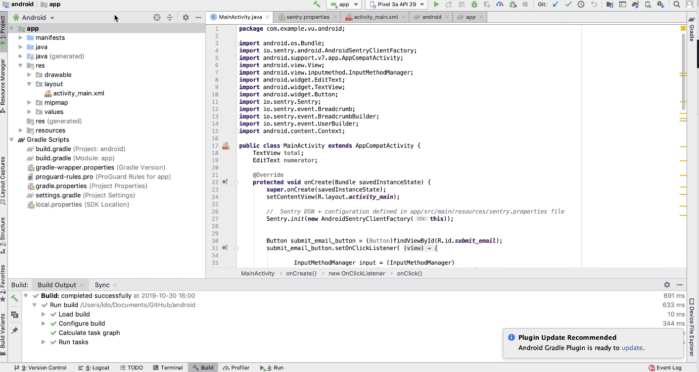

# Android Demo

This app demonstrates how to use Sentry in an Android application for capturing 4 types of exceptions:

- Unhandled Exceptions (2)
- Handled Exceptions
- Application Not Responding
- Native Crashes from C++ native code
- Message Capture

This app has all configuration (e.g. gradle) set to include Sentry SDK and ANR (Application Not Responding) and NDK (crash) events.

Sentry NDK libraries are used in addition to the Sentry SDK, for capturing errors and crashes in C++.

For use in **Production** see the [Official Sentry Android Documentation](https://docs.sentry.io/platforms/android/)
Additional documentation:
[ANR Configuration](https://docs.sentry.io/platforms/android/#configuration-options)
[NDK Configuration](https://docs.sentry.io/platforms/android/#integrating-the-ndk)

## Versions

| dependency    | version
| ------------- |:-------------:|
| sentry-android | 2.1.0-beta.1 |
| Android Studio | 3.6.2 |
| Gradle | 6.3 |
| AVD | Nexus 5x API 29 x86 |
| sentry-cli | 1.49.0 |
| macOS | Mojave 10.14.4 |

## Setup

1. `git clone git@github.com:sentry-demos/android.git`

2. Open project using Android Studio

3. Sync the project with the Gradle files

    ```
    Tools -> Android -> Sync Project with Gradle Files

    In some Android Studio version this will be available under:

    File -> Sync Project with Gradle Files
    ```

4. Put your Sentry DSN key in `AndroidManifest.xml` and your 'project' name in the Makefile

5. Put your AUTH Token and project name in sentry.properties

6. `make all`

7. Android Studio install Android NDK in Preferences > System & Behavior > System Settings > Android SDK > SDK Tools > select NDK for download

You can see debug files were uploaded in your Project Settings


You can maintain a separate branch which has your auth token.

## Run

1. Run 'app' in Android Studio on an Android Virtual Device.

## What's Happening

The MainActivity has 5 buttons that generate the following exception types:

1. **Unhandled Exception** of type Arithmetic Exception
2. **Unhandled Exception** of type NegativeArraySizeException + Strips PII (removes user IP address in beforeSend)
3. **Handled Exception** of type ArrayIndexOutOfBoundsException
4. **ApplicationNotResponding (ANR)** Uses an infinite loop to crash the app after 5 seconds and reports event to Sentry.
5. **Native Crash** of type SIGSEGV from native C++. The Sentry NDK sends this to Sentry.io for symbolication
6. **Native Message** send custom event/message from native C++.


## Android Native Crash: Missing Symbols for System Libraries

The Android team has added Android system symbol files to our built-in repositories (Add the new Android option in your project settings). If the native crash generated from your emulator is not fully symbolicated, this probably means our symbol server doesn't have the files relevant for your (virtual) device. 
In this case, you can fix that by updating Sentry's server. To do that:

1. Download the `Symbol Collector` app  (**o.sentry.symbol.collector-Signed.apk**) which is available in this [release](https://github.com/getsentry/symbol-collector/releases/tag/1.0.5)
2. Install it on to your emulator by drag-and-dropping the apk into the emulator screen.
3. Run the Symbol Collector application
4. Configure the target URL to transport the symbols to: `https://symbol-collector.services.sentry.io`
5. Click `Collect Symbols`
6. Once the transport completes, re-generate the crash.


## GIF Android Java Exception


## GIF Android ANR



## GIF Android Native Crash C++


## Technical Notes
**Release Technique #1**
Setting the release here is good if you really had a reason to override, eg. Paid vs Free versions of your apps
This is not generally for a customer. It's for testing so I can quickly iterate new releases while I'm testing.
```
<meta-data android:name="io.sentry.release" android:value="io.sentry.sample@1.0.0+1" />
```

**Release Technique #2**
Release was being done here:
```
build.gradle
defaultConfig {
    applicationId "com.example.vu.android"
    minSdkVersion 21
    targetSdkVersion 29
    versionCode 11
    versionName "1.2"
```
This would make for a release of `1.1.0 (11) com.example.vu@androidh1.2+11`. The version code is unique. This is already part of build system o Android. app won't compile without to.
The info in AndroidManifest.xml will override what's in build.gradle.

**Other**
Sometimes you'll see extra ANR events, because you have setting set to 3seconds
Hard to compare Total Number of Crashes to a report in Discover on handled:no and the release, because when a crash happens, you have to wait for the device to come back online again. There are some other technical reasons as well, which are still being sorted out.